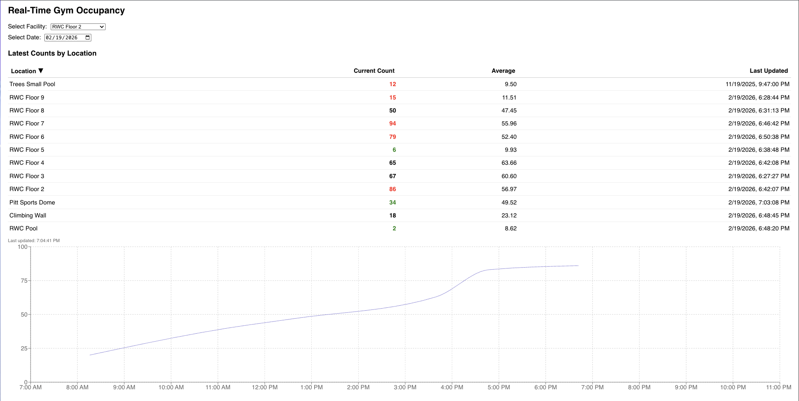

# Gym Occupancy Tracker

**A Spring Boot application for collecting, storing, and serving real-time and historical gym occupancy data at the University of Pittsburgh.**

---



## Overview

The **Gym Occupancy Tracker** automates the process of tracking live facility usage from the University of Pittsburgh’s [Campus Recreation Facility Counts](https://www.studentaffairs.pitt.edu/campus-recreation/facilities-hours/live-facility-counts).

It performs three key functions:

1. **Fetch** live occupancy data from the Pitt API.
2. **Store** it in a **PostgreSQL** database at scheduled intervals for historical trend analysis.
3. **Expose** the stored data through a **REST API**, enabling downstream applications such as dashboards or machine learning models.

This project lays the foundation for long-term gym usage analysis — providing insights into peak times, trends, and predictions for better facility management and student planning.

---

## Architecture Overview

```
+-----------------------+
|  Pitt API (External)  |
+----------+------------+
           |
           v
+-----------------------+
|  Gym Occupancy App    |
|  (Spring Boot)        |
|  -------------------  |
|  • Scheduler          |
|  • Data Mapper        |
|  • REST API           |
+----------+------------+
           |
           v
+-----------------------+
|  PostgreSQL Database  |
|  (Historical Storage) |
+-----------------------+
```

---

## Features

- **Automated Data Collection**: Scheduler runs every 10 minutes to call the Pitt occupancy API.
- **Data Persistence**: All facility counts and timestamps are stored in PostgreSQL for historical tracking.
- **REST API**: Exposes endpoints for retrieving, filtering, and managing facility data.
- **Data Cleanup**: Automatic retention policy ensures database size stays manageable.
- **Extensible Design**: Future-ready for dashboards and predictive modeling.

---

## Tech Stack

- **Backend:** Java 17 + Spring Boot 3
- **Database:** PostgreSQL
- **ORM:** Spring Data JPA / Hibernate
- **Scheduler:** Spring `@Scheduled` tasks
- **API Client:** `RestTemplate` for external API calls
- **Build Tool:** Maven

---

## Data Model

**FacilityCount Entity:**

| Field                    | Type          | Description                                 |
| ------------------------ | ------------- | ------------------------------------------- |
| `id`                     | Long          | Primary key                                 |
| `facilityName`           | String        | Name of the gym/facility                    |
| `locationName`           | String        | Location of the facility                    |
| `totalCapacity`          | int           | Maximum capacity of the facility            |
| `lastCount`              | int           | Most recent occupancy count                 |
| `lastUpdatedDateAndTime` | LocalDateTime | Timestamp from Pitt’s API                   |
| `recordedAt`             | LocalDateTime | When the record was collected by our system |
| `isClosed`               | boolean       | Whether the facility is currently closed    |

---

## REST API Endpoints

| Method   | Endpoint                    | Description                       |
| -------- | --------------------------- | --------------------------------- |
| `GET`    | `/api/facility-counts`      | Retrieve all records              |
| `GET`    | `/api/facility-counts/{id}` | Get a specific record             |
| `DELETE` | `/api/facility-counts`      | Delete all records (testing only) |

Future additions will include:

- Query by **date range**
- Query by **facility**
- Aggregated statistics (e.g., average occupancy per hour)

---

## Scheduler Configuration

Runs every 10 minutes:

```java
@Scheduled(fixedRate = 600_000)
public void fetchAndStoreOccupancyData() {
    // 1. Call Pitt API
    // 2. Map JSON -> Facility entities
    // 3. Save FacilityCount records in PostgreSQL
}
```

---

## Future Work

### Phase 3: Predictive Analytics

- Train models to **forecast gym occupancy** based on:

  - Time of day
  - Day of week
  - Semester patterns

- Provide a “Best Time to Visit” feature.

---

## Setup Instructions

### Prerequisites

- Java 17+
- Maven
- PostgreSQL (local or cloud)
- Optional: Docker

### Steps

1. **Clone the repository**

   ```bash
   git clone https://github.com/treyhutson/gym-occupancy.git
   cd gym-occupancy
   ```

2. **Configure PostgreSQL**
   Create a database:

   ```sql
   CREATE DATABASE gym_occupancy;
   ```

   Update your `application.properties`:

   ```properties
   spring.datasource.url=jdbc:postgresql://localhost:5432/gym_occupancy
   spring.datasource.username=postgres
   spring.datasource.password=your_password
   spring.jpa.hibernate.ddl-auto=update
   ```

3. **Run the app**

   ```bash
   mvn spring-boot:run
   ```

4. **Access the REST API**
   Open: [http://localhost:8080/api/facility-counts](http://localhost:8080/api/facility-counts)

---

## Maintenance

A scheduled cleanup process automatically deletes records older than 90 days to prevent database bloat.

---

## Author

**Trey Hutson**

---

## Project Goals

> _Build an intelligent, data-backed system to understand and predict gym usage patterns_
